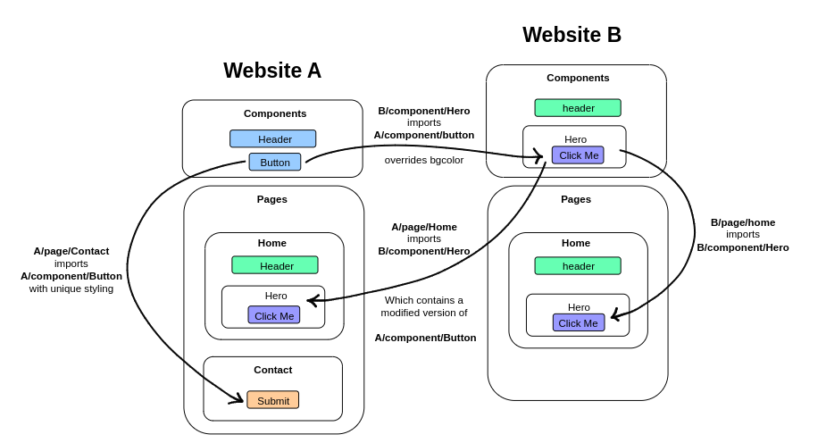
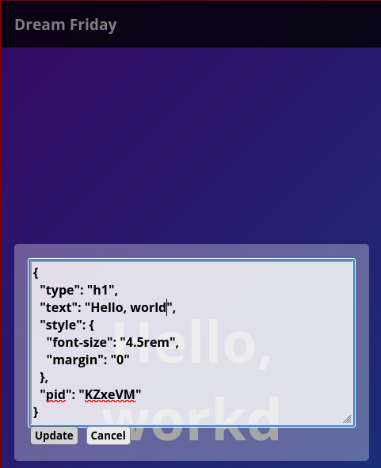

## [dreamfriday.com](https://dreamfriday.com)

A tiny, multi-tenant, JSON-based CMS for creating and sharing composable UI.

The platform's page rendering engine dynamically constructs a component tree by interpreting JSON data stored in PostgreSQL, keyed by domain. On request, it retrieves the site's complete topology including pages, elements, attributes, styling, and nested structures, then recursively builds and streams the rendered HTML. Styles are aggregated and injected into the document head, with class names generated on the fly to link elements efficiently.




### Authentication

The authentication system follows a challenge-response model using Ethereum wallets. Users sign a unique nonce (challenge) to verify ownership of their Ethereum address. 

We recommend using the MetaMask browser extension, which will allow you to create an address and login.

### Routes:

Serialized
- **GET /json**: returns a site's complete structure [Example](https://github.com/jwpaine/dreamfriday.com/blob/main/examples/dreamfriday.com.json)
- **GET /components**: returns all non-private components (PageElements)
- **GET /component/:name** retuns a single non-private component (PageElement)
- **GET /page/:name** returns a page's structure
- **GET /pages** returns all pages
- **GET /preview/json**: returns a site's complete preview structure for owner
- **GET /preview/components**: returns all preview components (PageElements) for owner
- **GET /preview/component/:name** retuns a single preview component (PageElement) for owner
- **GET /preview/page/:name** returns a page's preview structure
- **GET /preview/pages** returns all pages from preview
- **GET /preview/element/:pid** returns an element from anywhere in preview site structure by it's pid
- **GET /mysites** returns a PageElement containing the list of sites for the logged in user
- **GET /myaddress** returns a PageElement containing the authenticated user's address

Rendered:
- **GET /** renders page **'home'** (ie: URL/pages/home)
- **GET /page_name** renderes a page by name
- **GET /login** renders [dreamfriday.com/page/login](https://dreamfriday.com/page/login)
- **GET /admin** renders [dreamfriday.com/page/admin](https://dreamfriday.com/page/admin)
- **GET /manage** renders site details and JSON editor if user has ownership
- **GET /create** renders [dreamfriday.com/page/create](https://dreamfriday.com/page/create)

Factory:

- **POST /create** accepts **domain** and **template** (another domain to copy).
- **POST /admin/domain"** accepts **previewData** (JSON). Update's preview data for specified **domain**
- **POST /publish/domain** copies **preview** data to **production**
- **POST /preview/element/:pid** Updates element pid in the preview cache
- **GET /logout** destroys current session
- **GET /preview** toggle's preview mode for current session. Page routes will render preview data instead of production

Auth:

- **GET /auth/request?address=<wallet_address>** Generates a unique challenge (nonce) for the given Ethereum address.
- **POST /auth/callback** Verifies the signed challenge and authenticates the user.

### Topology

## Site

Site data describes the entire site, including all pages and sharable components.

[view site data for dreamfriday.com](https://github.com/jwpaine/dreamfriday.com/blob/main/examples/dreamfriday.com.json)

```JSON
{
  "pages": { "page_name" : { }, "page_name" : { } },
  "components" : { ... }
}
```

## Page

Page structure holds a page's head, body, and a set of redirection flags. 

- **RedirectForLogin** will redirect to the url supplied when logged in. 
  ex: [dreamfriday.com/login](https://dreamfriday.com/login) will redirect to /admin if logged in.
- **RedirectForLogout** will redirect to the url supplied when logged out.
  ex: [dreamfriday.com/admin](https://dreamfriday.com/admin) will redirect to /login if logged out.


```JSON
{
  "head" : { "elements": [ ] }, 
  "body" : { "elements": [ ] }, 
  "RedirectForLogin" : "url", 
  "RedirectForLogout" : "url"
}
```

## Page Element

```JSON
{
  "type" : "element_type",
	"attributes" : { "key1" : "value", "key2" : "value2"},
	"elements": [ ],
	"text" : "string",
	"style" :  { "key1" : "value", "key2" : "value2"},
	"import" : "component_name", 
	"private"  false 
}
```

Page elements model any HTML element, including their tag/type (ex: h1, p, a, ..), attributes (ex: id, class), text, styling, and any child elements contained within.

### Imports
Page Elements may import a component. This allows the importer to extend the properties and values of the component being imported.

**Local imports**: Elements defined within a site's **components** collection may be imported directly by name. 
**remote imports** import can be set to a remotly hosted component (Page Element)

example:
```JSON
{
  "import" : "https://dreamfriday.com/component/Header"
}
```
When a component is imported from a remote source, it will be automatically discoverable via your site's /components route unless **private** is set to true. A good use case for private is if you import data from a protected resource. Example: dreamfriday.com/admin imports dreamfriday.com/mysites, which is scoped to one's session. We would not want this data auto published under dreamfriday.com/components!

### Inheritance

When a Page Element imports a component, it inherits that component's styling, children, text, attributes unless those properties are defined by the Page Element.

Example: component **https://dreamfriday.com/component/Button**:

```JSON
{
  "type" : "button",
  "text" : "click me!",
  "style" : {
    "background" : "white",
    "color" : "black",
    "border" : "1px solid black"
  }
}
```

Import component:

```JSON
{
 "import" : "dreamfriday.com/component/Button",
 "text" : "my own text",
 "style" : {
  "border" : "none"
 }
}
```

Will render a white button, with no border, and custom text

## Component

Components are named Page Elements. They are publically discoverable via the **/components** route. As components are Page Elements, they can also import other internal or external components when being rendered, allowing one to build both local and cross-site component chains.

```JSON
{
  "component1" : {},
  "component2" : {}
}
```

## Creating a site

Navigating to /create will render the site creation page if one exists for your domain.

Supply domain name (eg: myawsomesite.dreamfriday.com)
Supply template. This should a url that returns SiteData JSON. 
Example: https://dreamfriday.com/json

## Preview Mode

Hitting the /preview route will toggle preview mode.
When in preview mode, there is a red border around the entire page you're viewing.

You can now nnativate the site and load various pages, all of which came from the preview column in the database. This preview data was catched, and now you may edit the preview cache before publishing your changes to the production column.

## Live editing

When preview mode is active, every element you see on the screen is assigned a preview identifier. You can see these when inspecting the site. The /preview/element/:pid route will return the JSON structure of this PageElement from cache, and posting PageElement structured JSON to the route, will update the element in the preview cache.

While in preview mode, clicking on an element will launch an element editor. Links are disabled while in preview moode to allow live editing.



Once you've made updates, navigate to /admin/domain to review changes, update the preview column, and publish changes to production.


